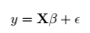
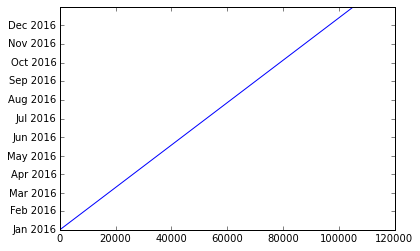
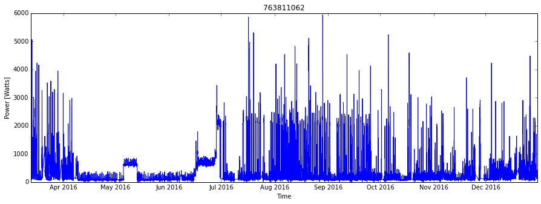
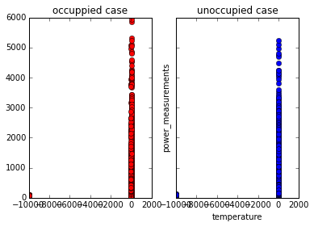
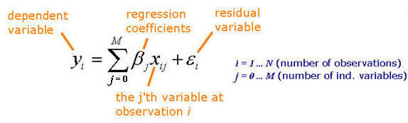
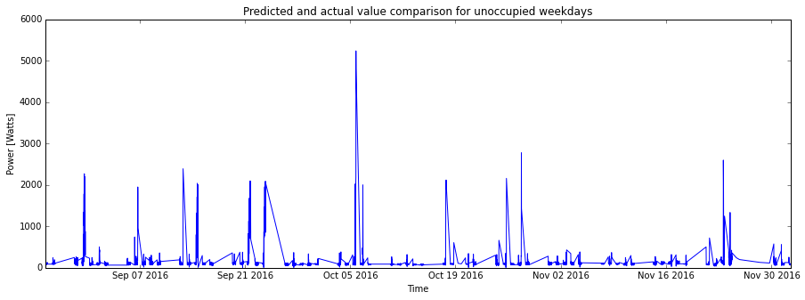
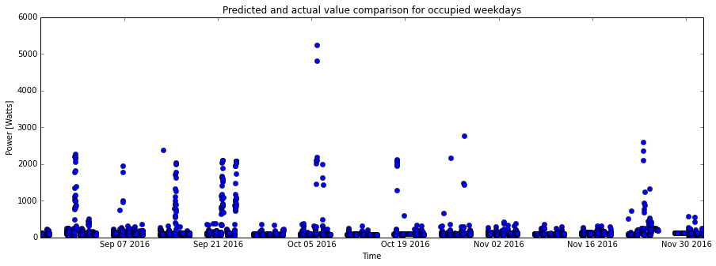

---
#### Being an Electric Utility and Energy industry planner, Data science practioner and a Deep (yes!) Machine Learning enthusiast, I wanted to analyse, model and predict my own power consumption patterns using machine learning techniques and the data collected from the smart meter installed at my house. As an added benefit, I can use my predictions to prepay my energy bill in advance and save some bucks too! :-)

#### I wanted this to be beneficial to other too who are getting started with Data Science/ Machine Learning/ Time Series Predictions. So, you can follow me along using the post below if you want to do analysis on your own data or on a different dataset. If time permits, I will also publish and write about predictions with Deep Learning (RNNs/LSTMs specifically) using PyTorch.

### Let's get started!

#### Let's first import few modules that we need to load and process the data


```python

import numpy as np  #Numeric Python
import pandas as pd #Data structures & anaylysis
import matplotlib   #Plotting and visualization
import matplotlib.pyplot as plt
import datetime as dt#Datatype to hold timestamps
#Magic function to enable inline plots in ipython
%matplotlib inline   
```

#### Power consumption with respect to time can be seen as a time series data. Training a machine learning algorithm based on large amount of such series data and using that to predict the power consumption given a time in the future is one approach. The machine learning algorithm could be as simple as a linear regression or sophisticated like a Deep neural network. In the case of linear regression, the data is modeled as a linear equation of the form .

#### We know that the power consumption is going to be dependent on the ambient temperature. So, I decided to first get weather data for my locality for further analysis

#### Luckily, the National Center for Environmental Information, part of the National Oceanic and Atmospheric Adminstration (NOAA) has made such weather [data available][1]. In fact, they have released a quality controlled dataset that is a "selected subsets of monthly, daily, hourly and sub-hourly (5-minute) USCRN/USRCRN data". "The most useful variables, including air temperature, precipitation, solar radiation, surface temperature, soil moisture and soil temperature data, are available

#### I am using the 15 minute (Sub-hourly) data for the analysis. (Fact: Smart Meters these days can report up-to 1-minute interval data!).

![1]: https://www.ncdc.noaa.gov/crn/qcdatasets.html

#### Let's get going with the code now. Importing/reading and preparing/cleaning the data for the analysis is the first step for any data-analysis task. (Fact: Real-world data is never perfect!). In the following cell, I am reading temperature data into by ipython notebook using pandas library's read_csv function.

#### I am then merging date and time columns and writing it out to another csv file named "temperature_data_stillwater_OK_2_W.csv" just to make it easy to run the analysis from this point without depending on the full dataset which I am not using for this analysis.


```python
dateparse = lambda x: pd.datetime.strptime(x, '%Y%m%d %H%M')
inputFile='CRNS0101-05-2016-OK_Stillwater_2_W.csv'
df = pd.read_csv(inputFile) 

df['LST_TIME']=[str(x).zfill(4) for x in df['LST_TIME']]
df['timestamp']=[str(x)+' '+str(y) for x,y in zip(df['LST_DATE'],df['LST_TIME'])]
df['timestamp']=[str(x).strip('\n') for x in df['timestamp']]
df['timestamp']=df['timestamp'].apply(lambda x: dt.datetime.strptime(x,'%Y%m%d %H%M'))
df.to_csv('temperature_data_stillwater_OK_2_W.csv')


#print (df['timestamp'][0])
```

#### Let's store the temperature data (which is air temperature and the time stamp) as a pandas dataframe here.


```python
temperatureDF=pd.DataFrame()
temperatureDF['timestamp']=df['timestamp']
temperatureDF['tempC']=df['AIR_TEMPERATURE']
temperatureDF.to_csv('temperature_data.csv',index=False)
```

#### Let's a function to convert the temperature time stamp into my desired format of "%Y-%m-%d %H:%M:%S" and reading the temperature csv (which we generated in the previous cells) using numpy's genfromtext function


```python
temperatureDateConverter = lambda d : dt.datetime.strptime(d.decode("utf-8"),'%Y-%m-%d %H:%M:%S')
temperature = np.genfromtxt('temperature_data.csv',delimiter=",",dtype=[('timestamp', type(dt.datetime.now)),('tempC', 'f8')],converters={0: temperatureDateConverter}, skip_header=1)
```

#### Let's print the temperature variable to see if we got it into desired format:


```python
print (temperature)
```

    [(datetime.datetime(2016, 1, 1, 0, 0), -1.8)
     (datetime.datetime(2016, 1, 1, 0, 5), -2.0)
     (datetime.datetime(2016, 1, 1, 0, 10), -1.9) ...,
     (datetime.datetime(2016, 12, 31, 17, 50), 6.3)
     (datetime.datetime(2016, 12, 31, 17, 55), 5.9)
     (datetime.datetime(2016, 12, 31, 18, 0), 5.6)]


#### Now let's print the type and size of the temperature data:


```python
print("The variable 'temperature' is a " + str(type(temperature)) + " and it has the following shape: " + str(temperature.shape))
```

    The variable 'temperature' is a <type 'numpy.ndarray'> and it has the following shape: (105337,)


```python
temperature.dtype.fields
```


    <dictproxy {'tempC': (dtype('float64'), 8), 'timestamp': (dtype('O'), 0)}>


```python
#dates = matplotlib.dates.date2num(temperature['timestamp'][0:10])
#tval=[i for i in range(0,10)]
#matplotlib.pyplot.plot_date()
```

#### Let's see how the timestamps look like, for this dataset:


```python
plt.plot(temperature['timestamp'])

#axes = plt.gca()
#plt.gcf().autofmt_xdate()
#axes.set_xlim([xmin,xmax])
#axes.set_ylim([ymin,ymax])
```


    [<matplotlib.lines.Line2D at 0x7f9ec83ede10>]





```python
#ttt=df.to_dict('list')
#print ttt['timestamp']
```

#### In the above plot, It can be visually seen that there no gaps in the temperature dataset, but to be sure about that, I am computing the minimum and maximum difference:


```python
print("The minimum difference between any two consecutive timestamps is: " + str(np.min(np.diff(temperature['timestamp']))))
print("The maximum difference between any two consecutive timestamps is: " + str(np.max(np.diff(temperature['timestamp'])))      )
```

    The minimum difference between any two consecutive timestamps is: 0:05:00
    The maximum difference between any two consecutive timestamps is: 0:05:00


#### The minimum and the maximum difference are both are 5 minutes, which means that there really is no gap in the datset, and all temperature measurements were taken 5 minutes apart.

#### The aim is to use updated temperature value at every 15 mins. We right now have 5 min interval dataset. Downsampling is the way to go. There are many ways to do the downsampling. This is beyond the scope of this post, so I am simply selecting every third sample to downsample the dataset:


```python
temperature = temperature[0:-1:3]
```

#### Making note of when the first and last timestamp are:


```python
print("First timestamp is on \t{}. \nLast timestamp is on \t{}.".format(temperature['timestamp'][0], temperature['timestamp'][-1]))
```

    First timestamp is on 	2016-01-01 00:00:00. 
    Last timestamp is on 	2016-12-31 17:45:00.


#### Loading the Power Data

#### I am using numpy's genfromtext function like how I did in the case of temperature data above.


```python
dateparse = lambda x: pd.datetime.strptime(x, '%Y%m%d %H%M')
inputFile='data_download.csv'
powerDF = pd.read_csv(inputFile)

powerDF['Meter Read Start']=powerDF['Meter Read Start'].apply(lambda x: dt.datetime.strptime(x.split('.')[0],'%Y-%m-%dT%H:%M:%S'))
powerDF['Meter Read End']=powerDF['Meter Read End'].apply(lambda x: dt.datetime.strptime(x.split('.')[0],'%Y-%m-%dT%H:%M:%S'))
powerDF.to_csv('power_data.csv',index=False)
```

#### Like the temperature data case, let's again define a function with datetime library to obtain the data and time in desired format


```python
dateConverter = lambda d : dt.datetime.strptime(d.decode("utf-8"),'%Y-%m-%d %H:%M:%S')
power = np.genfromtxt('power_data.csv',delimiter=",",names=True,dtype=['S255',dt.datetime,dt.datetime,'S255','f8','S255','f8','S255'],converters={1: dateConverter})
```


```python
print power.dtype.fields
```

    {'Consumption_or_Production_Value': (dtype('float64'), 526), 'Consumption_or_Production': (dtype('S255'), 271), 'Consumption_or_Production_Unit': (dtype('S255'), 534), 'Meter_Read_Start': (dtype('O'), 255), 'Meter_Number': (dtype('S255'), 0), 'Meter_Read_End': (dtype('O'), 263), 'Value': (dtype('float64'), 789), 'Units': (dtype('S255'), 797)}


** Notice ** that the column/header name **`Time`** is now going to be **`Meter_Read_Start`** moving forward

#### let's figure out how many meters there are (I expect it to be just one meter as I am using my home's smart meter data alone)


```python
name, indices, counts  = np.unique(power['Meter_Number'], return_index=True,return_counts=True)
```

#### Printing that information in a more readable style:


```python
for i in range(len(name)):
    print('Meter Number:'+str(name[i])+"\n\t from "+str(power[indices[i]]['Meter_Read_Start'])+" to "+str(power[indices[i]+counts[i]-1]['Meter_Read_Start'])+"\n\t or "+str(power[indices[i]+counts[i]-1]['Meter_Read_Start']-power[indices[i]]['Meter_Read_Start']))
    
```

    Meter Number:763811062
    	 from 2016-03-13 00:00:00 to 2016-12-30 17:45:00
    	 or 292 days, 17:45:00


```python
power = np.sort(power,order='Meter_Read_Start')
```

#### visualizing the data through the plot is the most effective way to get a feel of the data we are dealing with:


```python
fig1= plt.figure(figsize=(15,5))
plt.plot(power['Meter_Read_Start'],power['Value'])
plt.title(name[0])
plt.xlabel('Time')
plt.ylabel('Power [Watts]')
```


    <matplotlib.text.Text at 0x7f9ec98932d0>





#### The plot doesn't seem to help much in determining if there are gaps in the data set so I'll run some numbers to determine if there are gaps:


```python
power = np.sort(power,order='Meter_Read_Start')
print "The minimum difference between any two consecutive timestamps is: " + str(np.min(np.diff(power['Meter_Read_Start'])))
print "The maximum difference between any two consecutive timestamps is: " + str(np.max(np.diff(power['Meter_Read_Start'])))      
```

    The minimum difference between any two consecutive timestamps is: 0:00:00
    The maximum difference between any two consecutive timestamps is: 2 days, 0:15:00


#### the first and last timestamp for this (power) dataset:


```python
print "First timestamp is on \t{}. \nLast timestamp is on \t{}.".format(power['Meter_Read_Start'][0], power['Meter_Read_Start'][-1])
```

    First timestamp is on 	2016-03-13 00:00:00. 
    Last timestamp is on 	2016-12-30 17:45:00.


### Harmonizing the time series of temperature and power data

#### First I'm trying to recollect what times the two time series (power and temperature) start and end:


```python
print "Power data from {0} to {1}.\nTemperature data from {2} to {3}".format(power['Meter_Read_Start'][0], power['Meter_Read_Start'][-1], temperature['timestamp'][0], temperature['timestamp'][-1])
```

    Power data from 2016-03-13 00:00:00 to 2016-12-30 17:45:00.
    Temperature data from 2016-01-01 00:00:00 to 2016-12-31 17:45:00


#### The temperature has data for extra days. Clearly, we don't need the portion of the temperature data that is collected beyond the dates that we have power data from the smart meter at my home. I will go ahead and remove this (note that the magic number 24*4 corresponds to 24 hours):


```python
ttt=temperature

```


```python
temperature = ttt[5246:-24*4] 
```


```python
print "Power data from {0} to {1}.\nTemperature data from {2} to {3}".format(power['Meter_Read_Start'][0], power['Meter_Read_Start'][-1], temperature['timestamp'][0], temperature['timestamp'][-1])
```

    Power data from 2016-03-13 00:00:00 to 2016-12-30 17:45:00.
    Temperature data from 2016-02-24 15:30:00 to 2016-12-30 17:45:00


#### Creating the interpolation function here:


```python
def power_interp(tP, P, tT):
    # This function assumes that the input is an numpy.ndarray of datetime objects

    # Most useful interpolation tools don't work well with datetime objects
    # so I will convert all datetime objects into the number of seconds elapsed
    # since 1/1/1970 at midnight (also called the UNIX Epoch, or POSIX time):
    
    toposix = lambda d: (d - dt.datetime(1970,1,1,0,0,0)).total_seconds()
    tP = map(toposix, tP)
    tT = map(toposix, tT)
    
    # Now we interpolate
    from scipy.interpolate import interp1d
    f = interp1d(tP, P,'linear',bounds_error=False)
    
    return f(tT)
    
```

#### Let's use that funciton to get a copy of the interpolated power values, extracted at exactly the same timestamps as the temperature dataset:


```python
newPowerValues = power_interp(power['Meter_Read_Start'], power['Value'], temperature['timestamp'])
```

#### Let's rename the variables (for simplicity purposes), which are required to carry further analysis:


```python
toposix = lambda d: (d - dt.datetime(1970,1,1,0,0,0)).total_seconds()

timestamp_in_seconds = map(toposix,temperature['timestamp'])
timestamps = temperature['timestamp']
temp_values = temperature['tempC']
power_values = newPowerValues
```

#### Now let's put all of this data into a single structured array.


```python
a=(timestamps, power_values, temp_values)
data = np.asarray(a)
data = data.T
print "The size of the data is: " + str((data.shape)) + "and the type is:  " + str(type(data))
print data[0]
```

    The size of the data is: (29770, 3)and the type is:  <type 'numpy.ndarray'>
    [datetime.datetime(2016, 2, 24, 15, 30) nan 12.9]


#### Since we have the timestamps in '*datetime*' format we can easily do the extraction of the indeces:


```python
weekday = map(lambda t: t.weekday(), timestamps)
weekends = np.where([item==5 or item==6 for item in weekday]) 
weekdays = np.where([item ==0 or item==1 or item==2 or item==3 or item==4 for item in weekday])

```

#### Let's check if we did this correctly


```python
len(weekday) == len(weekends[0]) + len(weekdays[0]) ## This is assuming you have a tuple of ndarrays
```


    True


#### Seems like we did!

#### Since I am a 9 to 5 office worker, the unoccupied times of my home are during that interval (since the hour index starts from 0)


```python
hour = map(lambda t: t.hour, timestamps)
unoccupied = np.where([item>=8 and item<=18 for item in hour])
occupied = np.where([item<=8 or item>=18 for item in hour])

#print hour[50:100]
#print occupied[0][0:100]
#print unoccupied[0][0:100]

```


```python
print power_values
type(power_values)
```

    [  nan   nan   nan ...,  272.  144.  152.]


    numpy.ndarray


#### As our next task let's plot the power consumption during occupied and unoccupied timings of my home. The power and respective temperature values can be stored in different variables by using the indices we obtained in the previous cells.


```python
power_o=power_values[occupied];   # power measurements at occupied times
temp_o=temp_values[occupied];     # temperature measurements at occupied times
power_uo=power_values[unoccupied]; # power measurements at unoccupied times
temp_uo=temp_values[unoccupied];   # temperature measurements at unoccupied times

print str(power_o.shape) + str(power_uo.shape)
```

    (18600,)(13650,)


```python
plt.figure(figsize=(15,15));
f, (ax1, ax2) = plt.subplots(1, 2, sharey=True);
plt.xlabel('temperature');
plt.ylabel('power_measurements');
ax1.plot(temp_o, power_o,'ro');
ax1.set_title('occuppied case');
ax2.plot(temp_uo, power_uo, 'bo');
ax2.set_title('unoccupied case');
plt.xlabel('temperature');
```


    <matplotlib.figure.Figure at 0x7f9ef84fca50>





The above figure shows the plot between the power and temperatue in occupied and unoccupied cases. 

### Preparing the regression model

#### 


#### Creating a function to calculate temperature components based on given upper and lower boundaries/limits:


```python
def Tc(temperature, T_bound):
    # The return value will be a matrix with as many rows as the temperature
    # array, and as many columns as len(T_bound) [assuming that 0 is the first boundary]
    
    Tc_matrix = np.zeros((len(temperature), len(T_bound)))
    for ti in range(0,len(temperature)):
        if temperature[ti]>T_bound[1]:
            Tc_matrix[ti,0]=T_bound[1];
        
        else:
            Tc_matrix[ti,0]=temperature[ti];
            Tc_matrix[ti,1:]=0;
           
        for n in range(2,5):
            if temperature[ti]>=T_bound[n]:
                Tc_matrix[ti,n-1]=T_bound[n]-T_bound[n-1]
            else:
                Tc_matrix[ti,n]=temperature[ti]-T_bound[n-1]
                Tc_matrix[ti,n:]=0
               
        if temperature[ti]>T_bound[5]:# If strictly greater (as in the paper), a temp_value=T_bound[5] will be ignored
            Tc_matrix[ti,4]=T_bound[5]-T_bound[4]
            Tc_matrix[ti,5]=temperature[ti]-T_bound[5]
            
            
    return Tc_matrix


```

Tc_matrix check:


```python
B=(0,10,20,30,40,50)
Tc_mat=Tc(temp_values[0:10],B)
print temp_values[0:10]
print Tc_mat
len(Tc_mat)
```

    [ 12.9  13.2  13.2  13.6  13.7  13.7  13.6  13.5  13.2  12.8]
    [[ 10.   0.   0.   0.   0.   0.]
     [ 10.   0.   0.   0.   0.   0.]
     [ 10.   0.   0.   0.   0.   0.]
     [ 10.   0.   0.   0.   0.   0.]
     [ 10.   0.   0.   0.   0.   0.]
     [ 10.   0.   0.   0.   0.   0.]
     [ 10.   0.   0.   0.   0.   0.]
     [ 10.   0.   0.   0.   0.   0.]
     [ 10.   0.   0.   0.   0.   0.]
     [ 10.   0.   0.   0.   0.   0.]]


    10


#### The DesignMatrix function returns the X matrix for the regression problem (in the given equation) by taking in an ndarray of temperature values, a corresponding ndarray of timestamps and a tuple of temperature boundaries.


```python
def DesignMatrix(temperature,timestamps,T_bound):
    NumOfWeeks = 28
    model = "unoccupied weekends"
    if model == "full weekdays":
        m = 480 
        n = m*NumOfWeeks
    else:
        if model == "full weekends":
            m = 192 
            n = m*NumOfWeeks
        else:
            if model == "occupied weekdays":
                m = 5*10*4   # 200
                n = m*NumOfWeeks
            else:
                if model == "unoccupied weekends":
                    m = 112
                    # m = 14 hours per day * 4 intervals per hour * 2 days in a weekend
                    n = m*NumOfWeeks
    p = m-1                    
    DesignM = np.zeros((n,m+5))
    #DesignM[:,0] = 1
    DesignM[:,0:m]=np.vstack([np.eye(m)]*NumOfWeeks)
    Tc_matrix = Tc(temperature,T_bound)
    DesignM[:,p:]= Tc_matrix
    
    return DesignM
        
    
    

```

### Fitting the Model

#### Creating a function to calculate least square estimators:


```python
def beta_hat(DM,power_values):
    
    #np.linalg.pinv is being used get the pseudo inverse.
    
    beta_H = (np.linalg.pinv(DM.T.dot(DM)).dot(DM.T).dot(power_values))
        
    return beta_H
```

#### now we are choosing unoccupied weekdays (Monday through Friday, (9 AM to 6 PM) as the specific subset of the data.


```python
weekday = map(lambda t: t.weekday(), timestamps)
weekdays = np.where([item ==0 or item==1 or item==2 or item==3 or item==4 for item in weekday])
#print weekends[0][1:78]

hour = map(lambda t: t.hour, timestamps)
occupied = np.where([item>=8 and item<=18 for item in hour])

# finding the commen indices between weekends and unoccupied
idx_new = np.intersect1d(weekdays, occupied, assume_unique=False) 

type(idx_new)
idx_new.shape
```


    (9778,)


#### Dividing the data into training data and test data.


```python
whole_data =(timestamps[idx_new], power_values[idx_new], temp_values[idx_new])
trainData =(whole_data[0][0:5742][:], whole_data[1][0:5742][:], whole_data[2][0:5742][:])
#print len(trainData[0])
testData =(whole_data[0][5742:][:], whole_data[1][5742:][:], whole_data[2][5742:][:])
#print len(testData[0])
timestamps[idx_new].shape
```


    (9778,)


#### now let's create a tuple T bound that defines the boundaries for the temperature intervals that define the different temperature components in our subset dataset. For creating the tuple T-bound, first the lower and upper bound of the temp_values are calculated.


```python
T_lower = min(temp_values[idx_new])
print T_lower
T_upper = max(temp_values[idx_new])
print T_upper
```

    -9999.0
    38.7


```python
T_bound = (-10,10,30,50,70,90)

```

#### using the training dataset, we are generating the X matrix for our analysis using the DesignMatrix function we created above


```python
DM = DesignMatrix(trainData[2][0:3136],trainData[0][0:3136],T_bound)
```


```python
K = DM.T
L=K.dot(DM)
L.shape

#np.linalg.inv

M = np.linalg.pinv(L)
print M.shape

np.linalg.matrix_rank(L)

```

    (117, 117)


    113


#### Using the design matrix from above, I am finding the beta values using beta_hat function we defined above


```python
Beta_coeff = beta_hat(DM,trainData[1][0:3136])
#print Beta_coeff[0:10]
Beta_coeff.shape
```


    (117,)


#### Finally, in a single figure with a graph of power versus time, let's plot the actual power consumption in the test set, and the predictions of the model


```python
DM = DesignMatrix(testData[2][0:3136],testData[0][0:3136],T_bound)
Prediction = DM.dot(Beta_coeff)
```


```python
fig1= plt.figure(figsize=(15,5))
plt.plot(testData[0][0:3136],Prediction[0:3136], 'r')
plt.plot(testData[0][0:3136],testData[1][0:3136], 'b')
plt.title('Predicted and actual value comparison for unoccupied weekdays')
plt.xlabel('Time')
plt.ylabel('Power [Watts]')
```


    <matplotlib.text.Text at 0x7f9ec9e63550>





```python
fig1= plt.figure(figsize=(15,5))
plt.plot(testData[0][0:3136],Prediction[0:3136], 'ro')
plt.plot(testData[0][0:3136],testData[1][0:3136], 'bo')
plt.title('Predicted and actual value comparison for occupied weekdays')
plt.xlabel('Time')
plt.ylabel('Power [Watts]')
```


    <matplotlib.text.Text at 0x7f9ec9e32c10>





```python

```